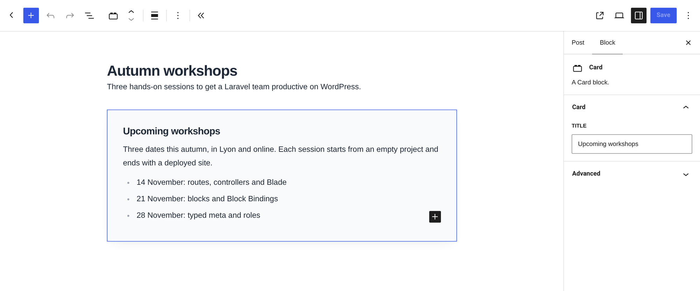
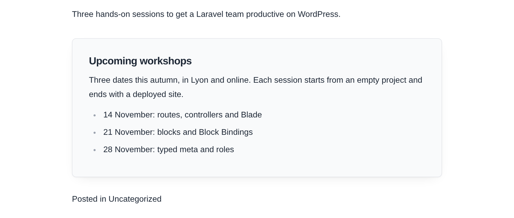

A custom Gutenberg block usually means two renderings of the same markup: a React component for the editor and a PHP template for the page. They drift apart, and editors end up working on something that does not look like the site. Pollora renders dynamic blocks with Blade, and since beta.9 the editor shows that same template, with the inner blocks editable in place.

In this tutorial we build a **card** block: a title set in the sidebar, and a body where editors can write paragraphs and lists.

## 1. Scaffold the block

From the project root, generate the block in the active theme. The `--inner-blocks` option prepares the files for nested content:

```bash
php artisan pollora:make:block card --theme --inner-blocks --category=design
```

The files land in `resources/views/blocks/card/`, next to your other Blade views. On the first run, the command also patches `vite.config.js` and adds the npm dependencies the blocks need. There is no service provider to write: Pollora registers the blocks of every theme, plugin and module by itself.

```text
resources/views/blocks/card/
├── block.json         # WordPress block metadata
├── render.blade.php   # the server-side template
├── index.jsx          # registers the block
├── edit.jsx           # the editor view, rendered from the template
├── editor.css         # editor-only styles
├── style.css          # shared styles
└── view.js            # front-end script (optional)
```

## 2. Declare the attributes

`block.json` is WordPress's own format. Add the attribute the block stores; the `render` key already points at the Blade file.

```json title="block.json" {8-10,15}
{
    "$schema": "https://schemas.wp.org/trunk/block.json",
    "apiVersion": 3,
    "name": "my-theme/card",
    "title": "Card",
    "category": "design",
    "textdomain": "my-theme",
    "attributes": {
        "title": { "type": "string", "default": "" }
    },
    "editorScript": "file:./index.jsx",
    "editorStyle": "file:./editor.css",
    "style": "file:./style.css",
    "viewScript": "file:./view.js",
    "render": "file:./render.blade.php"
}
```

Asset fields use `file:./` references, and Pollora resolves them through Vite.

## 3. Write the template

The template receives `$attributes`, `$content` (the rendered inner blocks), `$block` (the `WP_Block`) and `$isPreview`. Where the inner blocks should go, write `<InnerBlocks />`:

```blade title="render.blade.php"
<article {!! get_block_wrapper_attributes(['class' => 'card']) !!}>
    <h3 class="card__title">{{ $attributes['title'] ?? '' }}</h3>

    <InnerBlocks
        class="card__body"
        allowedBlocks="{{ json_encode(['core/paragraph', 'core/list']) }}"
        template="{{ json_encode([['core/paragraph', ['placeholder' => __('Write the card…', 'my-theme')]]]) }}"
        templateLock="false"
    />
</article>
```

A few rules keep it safe:

- `{{ }}` escapes. Keep `{!! !!}` for `get_block_wrapper_attributes()` and `$content`, which WordPress has already escaped.
- Options that take arrays or objects are JSON. Write them with `{{ json_encode(...) }}`, which also escapes the quotes the attribute cannot hold raw.
- One `<InnerBlocks />` per block. Gutenberg keeps a single list of inner blocks, so a second tag is dropped.

## 4. Add the title field

The generated `edit.jsx` is one line: `window.pollora.blocks.bladeEdit(metadata)` returns a React component that previews the Blade template and makes `<InnerBlocks />` editable. Since it is a component, you can wrap it and add the block's settings next to it:

```jsx title="edit.jsx" {6,12-22}
import { InspectorControls } from '@wordpress/block-editor';
import { PanelBody, TextControl } from '@wordpress/components';
import { __ } from '@wordpress/i18n';
import metadata from './block.json';

const Preview = window.pollora.blocks.bladeEdit(metadata);

export default function Edit(props) {
    const { attributes, setAttributes } = props;

    return (
        <>
            <InspectorControls>
                <PanelBody title={__('Card', 'my-theme')}>
                    <TextControl
                        __nextHasNoMarginBottom
                        label={__('Title', 'my-theme')}
                        value={attributes.title}
                        onChange={(title) => setAttributes({ title })}
                    />
                </PanelBody>
            </InspectorControls>
            <Preview {...props} />
        </>
    );
}
```

Each change of the title re-renders the template on the server, so the preview is always the real markup.

## 5. Style it

`style.css` is loaded in the editor and on the page. The theme's `theme.json` presets are CSS variables, so the card follows the theme's palette:

```css title="style.css"
.card {
    margin-block: 2rem;
    padding: 2rem;
    border: 1px solid var(--wp--preset--color--outline);
    border-radius: var(--wp--preset--border-radius--lg, 12px);
    background: var(--wp--preset--color--surface);
    box-shadow: 0 1px 2px rgb(0 0 0 / 0.04), 0 8px 24px -12px rgb(0 0 0 / 0.12);
}

.card__title {
    margin: 0 0 0.75rem;
    font-size: var(--wp--preset--font-size--xl, 1.5rem);
}

.card__body > * + * {
    margin-top: 0.75em;
}
```

## 6. Build and insert it

```bash
cd themes/your-theme
npm install
npm run dev    # hot reload while you work, npm run build for production
```

Open a post, insert **Card**, set its title in the sidebar and type in its body. The paragraphs and the list are ordinary core blocks, edited right inside the rendered template:



On the page, the tag is replaced by the inner blocks, wrapped in a `div` that carries the tag's `class`:

```html
<article class="card wp-block-my-theme-card">
    <h3 class="card__title">Upcoming workshops</h3>
    <div class="card__body"><p>Three dates this autumn…</p><ul>…</ul></div>
</article>
```



The editor renders the same `div` around the editable blocks, so a single stylesheet serves both.

## 7. Polish the editor view

In the editor, the template is rendered by the server and turned into editor elements. `$isPreview` is true there, which is the place for hints that should never reach visitors. Add this under the title in `render.blade.php`:

```blade
@if ($isPreview && empty($attributes['title']))
    <p class="card__hint">{{ __('Give the card a title in the block settings.', 'my-theme') }}</p>
@endif
```

Scripts are left out of the preview, so a carousel or an analytics snippet in the template does not run inside the editor.

## Coming from ACF blocks?

The tag, its options and its wrapper follow ACF's `<InnerBlocks />`. `allowedBlocks`, `template`, `templateLock` and `orientation` behave the same way. The only visible difference is the default wrapper class: `pollora-inner-blocks` instead of `acf-innerblocks-container`.

What changes is everything around the template: Blade components, Tailwind classes picked up from `resources/views`, Vite with hot reload, and no `register_block_type()` call anywhere.

> **Going further.** The [Gutenberg blocks](/blocks/gutenberg-blocks/) page lists every option of `pollora:make:block`, static blocks included, and explains how the Vite configuration is generated.
