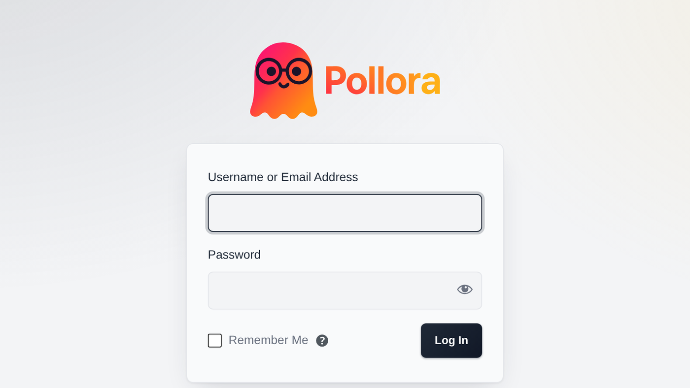

WordPress loads your theme on `wp-login.php`. `functions.php` runs, the theme is active, and yet none of its design reaches the page. We measured it on a site whose `theme.json` holds 304 colours: zero occurrences of `wp--preset--color` in the HTML of its login screen. Whatever a site looks like, its users have always signed in through the same form.

Two pre-releases shipped today. Beta.5 fixes that screen, and beta.4 answers a question every theme developer has asked at least once.

## A login screen that looks like the site

The feature is opt-in: a theme with no `config/login.php` gets WordPress's screen unchanged, byte for byte. Add the file, and the screen is yours:

```php title="themes/your-theme/config/login.php"
<?php

return [
    'enabled' => true,

    'logo' => [
        // A path inside the theme, read from disk and inlined
        'source' => 'resources/assets/images/logo.svg',
        'width' => 220,
        'url' => home_url('/'),
        'text' => get_bloginfo('name', 'display'),
    ],

    'powered_by' => true,
];
```



Notice what is **not** in that file: colours, radii and typography. They already live in `theme.json`, and Pollora reads them from there. Restyle the theme, and the login screen follows, with nothing to keep in sync.

### Design roles, not palette names

A palette is a vocabulary, not a set of roles. One theme calls a shade `primary-hover`, another `primary-vivid`, and a Tailwind-built `theme.json` buries both under three hundred primitives named `red-500`. So the login screen states the roles it needs (`background`, `foreground`, `primary`, `outline`, `radius`, `font`…) and, for each one, the preset slugs it accepts, most specific first.

A theme that speaks that vocabulary configures nothing. One that names things its own way points a role at its slugs, or writes a value in:

```php
'tokens' => [
    'primary' => ['brand-600', 'brand-500'],  // slugs to try, in order
    'accent' => 'oklch(70% .2 30)',           // a value no preset holds
],
```

Every role resolves to something, so even a theme without a `theme.json` gets a coherent screen rather than half a stylesheet on top of WordPress's defaults.

### The logo cannot 404

A file inside a Pollora theme has no public URL: only the Vite build is served. The logo is therefore read from disk and inlined (SVG, PNG, JPEG, GIF, WebP or AVIF, up to 96 KB). An absolute URL or an attachment ID works too, and without a `source` the site's custom logo is used. Give a `width` and the height comes from the file's own proportions, so a wide wordmark is not squeezed into WordPress's 84 × 84 box.

### Taking over from a plugin

A module or a plugin can replace any part of the screen without touching the theme, through four filters: `pollora/login/palette`, `pollora/login/logo`, `pollora/login/styles` and `pollora/login/credit`.

## Which template answered this page?

WordPress offers no way to see which template rendered a request, short of reading the code and guessing. With a Blade hierarchy on top, the guess gets harder. From beta.4, whenever `WP_DEBUG` is on, every page says it in an HTML comment printed on `wp_head`. View the source, and the answer is at the top.

In a block theme, the marker always reads `template-canvas`, because WordPress renders every block template through the same file. There, the `<body>` classes (`single-post`, `search-results`, `error404`) tell templates apart.

## Also in these releases

- Discovery now says so when one location takes more than 250 ms to scan, naming the location, the time and how many classes it found. A slow scan used to be absorbed in silence.
- A theme's `config/login.php` loads on `init`, like `menus.php` and `sidebars.php`, so `__()` works in it.

The full list is in the [changelog](/changelog/), and the login screen is documented in [Theme structure](/theming/theme-structure/#login-screen).
